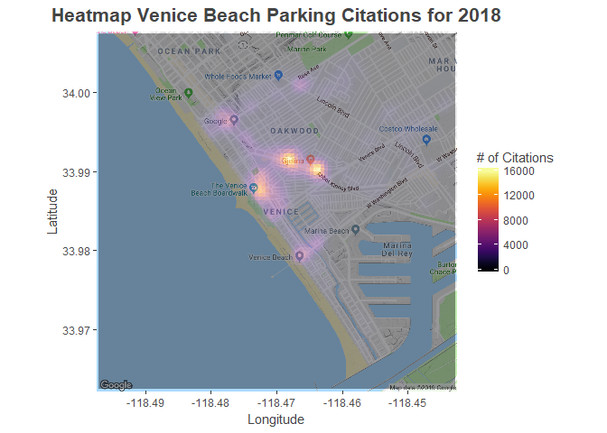

Analysis and Visualizations
================
Project Beginning March 22, 2019

Motivation for This Project
---------------------------

Los Angeles depends on citation revenue to power its police department, and raked in $140.4 million dollars from parking citations last year!

My friends that still live in Los Angeles constantly complain about getting parking citations. One of my best friends even got 2 parking tickets back-to-back when visiting me one time! This is understandable, especially when you see so many confusing signs.


They asked for my help (with my budding data science skills) to help them avoid getting more citations in the future.

Some questions that they had:

1.  When do the citations generally happen?
2.  Where do the citations often occur?
3.  What are the reasons for the citations?
4.  What kinds of meters, if any, should they avoid?
5.  Are there any cars that are particularly susceptible?

This analysis will attempt to answer these questions, focusing on 2018 for the analysis.

The Data and Assumptions
------------------------

The data, hosted on Kaggle, is open-sourced and provided by the City of Los Angeles through their Kaggle organization page at <https://www.kaggle.com/cityofLA>. It contains ~8.8 million parking citations from 2015 until present, including information on the time and date of the citation, latitude and longitude coordinates of the citation location, car make, and fine amount.

Additionally, we define the boundaries of the parking data by the scope of jurisdiction of Los Angeles' parking division:


Also, there is an important factor to note about this data: while each citation has a unique number, vehicles were often cited more than once on the same occasion (for example, parking on a red curb and having expired tabs). Thus, there are fewer than 8.8 million unique cars that were cited. Please keep this in mind going forward.

Finally, I was able to find additional data about meter locations, time limits, and other data from <https://data.lacity.org/A-Livable-and-Sustainable-City/Parking-Meter-Inventory/s49e-q6j2/data>. This data was included throughout this analysis.

Global Options and Libraries
----------------------------

``` r
knitr::opts_chunk$set(fig.align = "center") 
# Import Libraries.
x <- c("dplyr", "magrittr", "lubridate", "ggplot2", "fasttime", "scales",
       "maps", "ggmap", "tidyr", "data.table", "gridExtra", "viridis",
       "stringr")
invisible(lapply(x, library, character.only = TRUE))
# Created custom functions for this project. If you would like to view their
# internals, please go here: https://github.com/datatoinfinity/Los-Angeles-Vehicle-Citations-Project/blob/master/Custom%20Created%20Functions.R.
source("Custom Created Functions.R")
rm(x)
```

Importing the Data
------------------

Please note, data cleaning took place in Data Cleaning.Rmd. If you would like to see this, please go here: <https://github.com/datatoinfinity/Los-Angeles-Vehicle-Citations-Project/blob/master/Data%20Cleaning.Rmd>.

``` r
coord_data <- fread("Citation Coordinates", sep = ",")
tot_cits_month <- fread("Total Citations By Month", sep = ",",
                        stringsAsFactors = TRUE)
april_cits <- fread("April 2018 Cits.csv", sep = ",")
sept_cits <- fread("September 2018 Cits.csv", sep = ",")
avg_cits_by_TOD <- fread("Average Citations by TOD", sep = ",")
cits_type_by_hr <- fread("Violation Descriptions by TOD", sep = ",")
cits_type_by_car <- fread("Violation Descriptions by Car Make", sep = ",")
worst_meters <- fread("Evil Meter Locations and Citations", sep = ",")
```

Fix Columns (Factors and Date Times) for Plotting
-------------------------------------------------

Some of the data from the .csv files had to be converted to factors (since in string format and I wanted a specific axis order in later plots). Other data needed to be converted back into date-times and have new date variables created.

``` r
# Cleanup tot_cits_month data.
# To reorder future graphs.
tot_cits_month$Month <- factor(tot_cits_month$Month,
                               c("Jan", "Feb", "Mar", "Apr", "May","Jun",
                                 "Jul", "Aug", "Sep", "Oct", "Nov", "Dec"))
# Cleanup cits_type_by_car data.
cits_type_by_car$Make <- factor(cits_type_by_car$Make, 
                                levels = c("HYUN", "MERZ", "BMW", "CHEV",
                                           "NISS", "FORD", "HOND", "TOYT"))
# Cleanup avg_cits_by_TOD data.
avg_cits_by_TOD$Weekday <- factor(avg_cits_by_TOD$Weekday,
                                  levels = c("Monday", "Tuesday", "Wednesday",
                                             "Thursday", "Friday","Saturday",
                                             "Sunday"))
# Fix the date times into proper formatting for graphing.
avg_cits_by_TOD$TOD <- fastPOSIXct(avg_cits_by_TOD$TOD, tz = "UTC")
tz(avg_cits_by_TOD$TOD) <- "America/Los_Angeles"
# Cleanup worst_meters data.
worst_meters$Time_Limit <- factor(worst_meters$Time_Limit,
                                  levels = c("10HR", "4HR", "2HR",
                                             "1HR",
                                             "30MIN", "15MIN"))
# Cleanup cits_type_by_hr data.
cits_type_by_hr$Hour <- factor(cits_type_by_hr$Hour)
# Cleanup april_cits data.
april_cits$Day <- factor(april_cits$Day)
april_cits$Date <- ymd(april_cits$Date)
# Cleanup sept_cits data.
sept_cits$Day <- factor(sept_cits$Day)
sept_cits$Date <- ymd(april_cits$Date)
```

Tickets by Month for 2018
-------------------------

``` r
graph_cits(tot_cits_month, "Total Citations by Month for 2018", "Month",
           "Total_Month_Cits", "Month", "# of Citations")
```


Somewhat surprising is the decreasing trend in total parking citations by month as the year progressed. A few scenarios immediately come to mind:

1.  Maybe there is a yearly parking citation quota or revenue amount the department has to hit, which it does so within the first half of the year?
2.  Maybe meter maids / other parking attendants take more personal vacations during the latter half of the year, and do not have their shifts covered while they are gone?
3.  Maybe there are more holidays in the latter half of the year, affecting parking citation issuance?

Scenario (3) can potentially be tested, which I do so in a cursory manner:

``` r
tot_cits_month$Month <- factor(tot_cits_month$Month,
                               levels = c("Jan", "Feb", "Mar", "Apr", "May",
                                          "Jun", "Jul", "Aug", "Sep", "Oct",
                                          "Nov", "Dec"))
# Manually counted holidays for the department in 2018 based on information
# found in https://ladot.lacity.org/sites/g/files/wph266/f/LACITYP_027517.pdf.
# Please note, this is not a perfect method.
tot_cits_month$Holidays <- as.numeric(list(2, 1, 0, 0, 1, 0, 1, 0, 1, 1, 2, 1))
tot_cits_month$Num_Days <- as.numeric(list(31, 28, 31, 30, 31, 30, 31, 31, 30,
                                           31, 30, 31))
model <- lm(Total_Month_Cits ~ Holidays + Num_Days, data = tot_cits_month)
summary(model)
```

    ## 
    ## Call:
    ## lm(formula = Total_Month_Cits ~ Holidays + Num_Days, data = tot_cits_month)
    ## 
    ## Residuals:
    ##    Min     1Q Median     3Q    Max 
    ## -21979 -12618  -5103  15594  31532 
    ## 
    ## Coefficients:
    ##             Estimate Std. Error t value Pr(>|t|)
    ## (Intercept)    95933     194458   0.493    0.634
    ## Holidays       -9865       8005  -1.232    0.249
    ## Num_Days        2590       6382   0.406    0.694
    ## 
    ## Residual standard error: 19050 on 9 degrees of freedom
    ## Multiple R-squared:  0.1595, Adjusted R-squared:  -0.0273 
    ## F-statistic: 0.8538 on 2 and 9 DF,  p-value: 0.4576

From the model, we see that ~16% of the total variation in the number of citations per month can be explained by the number of meter holidays in a given month and the number of days in that month. Not great. Moreso, please note, that there are quite a few limitations with this result:

1.  Meter holidays only reduce citations for meter citations, preferential parking restrictions, and times limits and some parking signs. These holidays do holidays do not affect safety related violations (parking on a red curb for example).
2.  This model is only built on 2018 data, so 12 observations. Hopefully would be better if we used past data.
3.  This Multiple Linear Regression model is one of many potential models, albeit it the simplest to implement and read.

Daily Citation Totals for April 2018 and September 2018
-------------------------------------------------------

I chose these months since they have similar numbers of days, though September did have a holiday. That will likely impact citation totals on the holidays. Please keep that in mind.

``` r
graph_cits(april_cits, "Total Citations by Day for April 2018", "Day",
           "Tot_Day_Cits", "Day", "# of Citations")
```


``` r
graph_cits(sept_cits, "Total Citations by Day for September 2018", "Day",
           "Tot_Day_Cits", "Day", "# of Citations")
```


September 2 was Labor Day, which seems to have affected the citations issued on that day and the day after. But there is not explanation for why the days of September 7 and 14, both Fridays, saw decreased citation counts. Likely, the holiday and these 2 unusual days were major influences in why September had ~47,400 citations fewer than April.

Average Cits by Time of Day and Weekday for 2018
------------------------------------------------

``` r
# Limits so the graph begins and ends at midnight.
x_lims <- c(floor_date(min(avg_cits_by_TOD$TOD), "day"),
            ceiling_date(max(avg_cits_by_TOD$TOD), "day"))
ggplot(avg_cits_by_TOD, aes(x = TOD, y = Mean_Cits)) +
  geom_line(color = "red", size = 0.2) + 
  theme(axis.text.x = element_text(angle = 90, hjust = 1),
        plot.title = element_text(hjust = 0.5), legend.position = "bottom") + 
  labs(x = 'Citation Time (Military Time)', y = "Average # of Citations",
       title = "Average Number of Citations By Weekday and Time for 2018") + 
  ylim(0, 30) +
  facet_wrap(~ Weekday, ncol = 2, scales = "free") +
  scale_x_datetime(breaks = date_breaks("1 hour"), limits = x_lims,
                   labels = date_format("%H:%M", tz = "America/Los_Angeles"),
                   expand = c(0, 0))
```


Naturally we see that:

1.  Weekday citations peak at 8am, 10am, and 12pm. This is likely since the meter maids conduct their rounds every few hours, corresponding with meter or parking space time limits.
2.  Saturday and Sunday see very little parking citation activity since many peole aren't working, and in the case of Sunday, meters don't run on Sundays.

More surprisingly:

1.  It seems that after 1pm on weekdays, there is a significant fall off in parking citations issued. Perhaps the meter maids have a daily quota that they must hit. It is understandable that after, say, 6pm, that citations would decrease as many meters and parking signs don't apply after 6pm. But the reason why there is a drop off on weekdays between 1pm and 6pm is perplexing.

Violation Descriptions by Hour for 2018
---------------------------------------

``` r
ggplot(cits_type_by_hr, aes(x = Hour, y = Total_Cits,
                            fill = Violation_Description)) + 
  geom_bar(stat = "identity") +
  theme(axis.text.x = element_text(hjust = 0.5),
        plot.title = element_text(hjust = 0.5)) +
  labs(title = paste("Proportion of Violations By Hour for 2018", ""),
       x = "Hour of the Day (Military Time)", y = "# of Citations",
       fill = " Top 7 Types of Violations")
```


Unsurprisingly:

1.  Most parking citations are concerning street sweeping / cleaning, which begins at 8am in most places.
2.  The spike in citations issued at 8am, 10am, and 12pm fits a similar line of thought with the last section, as meter maids are likely making their rounds.

Violation Descriptions by Car Make for 2018
-------------------------------------------

``` r
# To remove x-axis scientific notation on the plot. Also could probably turn
# this code into a function in the future, to be used with the plot and the
# previous.
options(scipen = 10000)
ggplot(cits_type_by_car, aes(x = Make, y = Total_Cits,
       fill = Violation_Description)) + 
  geom_bar(stat = "identity") +
  coord_flip() + 
  theme(axis.text.x = element_text(hjust = 0.5),
        plot.title = element_text(hjust = 0.5)) +
  labs(title = "Proportion of Violations By Top Car Makes for 2018",
       x = "Top 8 Car Makes", y = "# of Citations", fill = "Type of Violation")
```


Unsurprisingly, there seems to not be a relationship between owning a certain make of car and being more susceptible to a specific kind of parking citation. Please note that these are the top car makes in the dataset, and it could be very well that very expensive cars (bentleys, rolls-royces, etc.) show some interesting results. Yet these expensive cars are respectively rare in this dataset.

Additionally, we could run some statistical tests to more concretely compare proportions of types of violations between different car makes, but the visual data is sufficently compelling at this point.

Heatmaps of Parking Citations for 2018
--------------------------------------

### Heatmap of All of Los Angeles

``` r
# Set Google API Key for map calls. The below is a fake key to protect my key.
# Additionally, some enabling of geocoding on GoogleAPIs account is necessary.
# Use this line of code for registering the API key for google cloud:
# register_google(key = "Your Key Here")

# Look at all of Los Angeles first.
la <- get_map(location = "los angeles", zoom = 10)

ggmap(la) + 
  coord_cartesian() + 
  geom_hex(data = coord_data, aes(x = New_Longitude, y = New_Latitude),
           alpha = 0.5, color = "black", show.legend = TRUE, stat = "binhex") +
  scale_fill_gradientn(colours = c("blue","red")) +
  labs(title = str_c('Heatmap of Parking Citations across LA for 2018'),
       x = "Longitude", y = "Latitude", fill = '# of Citations') +
  theme(text = element_text(color = "#444444"),
        plot.title = element_text(size = 16, face = 'bold', hjust = 0.5))
```


Looking at this heatmap, Downtown Los Angeles appears to probably be the worst place for parking citations in all of Los Angeles! This is not unsurprising (especially if you have ever tried to park there downtown)!

Additional areas of heavy citations include Hollywood and West Hollywood, Mid-Wilshire, the UCLA / Westwood area, and Venice Beach. We will look at a few of these areas momentarily.

### Let's Look at Downtown LA More Closely

``` r
# Note, the concentration and gradients for the zoomed in maps reflect only
# the citations that are located in that new map. 
# Limits for the zoomed in for Downtown LA.
dt_lat_lims <- c(34.03, 34.07)
dt_lon_lims <- c(-118.3, -118.21)
dt <- get_map(location = c(lon = mean(dt_lon_lims), lat = mean(dt_lat_lims)),
              zoom = 15L)
dt_coords <- zoom_in(coord_data, dt, "New_Latitude", "New_Longitude")
make_map(dt_coords, dt, "New_Latitude", "New_Longitude",
         "Heatmap of Downtown LA Parking Citations for 2018")
```


So it seems probably the worst intersection / block to park at in Los Angeles is at the corner of S Spring St and W 5th St. Let's take a closer look on Google maps!


While in some ways, it looks like normal intersection, think about this:

1.  Red zones on each corner.
2.  Multiple parking signs on top of one another.
3.  A UPS truck in the image likely indicates substantial commercial traffic activitiy which could also increase the number of tickets issued for an area.

### Let's Look at the UCLA/Westwood Area More Closely

``` r
# Limits for the zoomed in for UCLA/Westwood Area.
ucla_lat_lims <- c(34.0, 34.1)
ucla_lon_lims <- c(-118.47, -118.4)
ucla <- get_map(location = c(lon = mean(ucla_lon_lims),
                             lat = mean(ucla_lat_lims)),
                zoom = 14L)
ucla_coords <- zoom_in(coord_data, ucla, "New_Latitude", "New_Longitude")
make_map(ucla_coords, ucla, "New_Latitude", "New_Longitude",
         "Heatmap of Westwood Parking Citations for 2018")
```


The major area for parking citations in Westwood is an area of Sawtelle that has many popular eateries but virtually no parking! While there are a few small parking lots and some meters, most people prefer to take their chances parking in the residential neighborhoods in the surrounding areas. Yet with long wait times at the eateries, I wouldn't be surprised if this increased the chances of being caught illegally parking by the meter maid!

Future analysis could determine exactly what kind of parking violations are happening, such as Preferential Parking violations which may relate to parking in surrounding residential areas that require permits.

### Let's Look at Venice More Closely

``` r
# Limits for the zoomed in for Venice.
vn_lat_lims <- c(33.94, 34.03)
vn_lon_lims <- c(-118.52, -118.42)
vn <- get_map(location = c(lon = mean(vn_lon_lims), lat = mean(vn_lat_lims)),
              zoom = 14L)
vn_coords <- zoom_in(coord_data, vn, "New_Latitude", "New_Longitude")
make_map(vn_coords, vn, "New_Latitude", "New_Longitude",
         "Heatmap Venice Beach Parking Citations for 2018")
```



Unsurpsingly, the main areas of citations near Venice Beach are on Abbot Kinney Blvd (which has many popular restaurants, food trucks, but some of the littlest amount of parking spots that I encountered while in Los Angeles). Additionally, the high amounts of citations in the area near the Venice Beach Boardwalk is likely due to many tourists or locals wanting to go to the boardwalk but unable to find parking nearby, thus testing their luck with some illegal parking!

Most Dangerous Meters and Their Locations for 2018
--------------------------------------------------

Let's first look at a plot of the number of tickets per meter to get a better idea of the number of meter citations for a given meter within the year:

``` r
# 95% percentile was somewhat arbitrary.
top_outliers <- quantile(worst_meters$Total_Cits, .95)
ggplot(data = worst_meters, aes(Total_Cits)) +
  geom_bar(fill = "red") +
  labs(title = "# of Meters with a Given Amount of Citations for 2018",
       x = "# of Citations due to the Meter", y = "Total # of Meters") +
  theme(text = element_text(color = "#444444"),
        plot.title = element_text(size = 16, face = 'bold', hjust = 0.5)) +
  geom_vline(aes(xintercept = median(worst_meters$Total_Cits),
                 color = "6 (Median)"), size = 1.2) +
  geom_vline(aes(xintercept = top_outliers, color = "30 (95th Percentile)"),
             size = 1.2) +
  scale_color_manual(name = "Vertical Lines",
                     values = c(`6 (Median)` = "black",
                                `30 (95th Percentile)` = "blue"))
```


So while the median meter had only 6 parking citations last year, the top 5% of meters had over 30, with some meters as high as 200! This means that many meters are likely generating thousands, if not tens of thousands, of dollars of revenue for the city each year!

``` r
# Some meters had values that were outside of the map boundaries and were thus
# removed.
top_worst_meters <- worst_meters %>%
  filter(Total_Cits >= unname(top_outliers))
ggmap(la) + 
  coord_cartesian() + 
  geom_point(data = top_worst_meters, aes(x = Approx_Lon, y = Approx_Lat,
                                      color = Time_Limit),
             alpha = 1, size = 2) +
  labs(title = "Top 5% of Meters by Total Citations in 2018",
       x = "Longitude", y = "Latitude", color = "Meter Time Limit") +
  theme(text = element_text(color = "#444444"),
        plot.title = element_text(size = 16, face = 'bold', hjust = 0.5))
```


Like we expected, most of the worst meters are in Downtown Los Angeles, Hollywood, West Hollywood, Mid-Wilshire, the UCLA / Westwood area, and the Venice Beach area.

In fact, the worst 2 meters are located in Glendale.

``` r
head(top_worst_meters, 2)
```

    ##   Meter_Id Time_Limit Total_Cits Approx_Lat Approx_Lon
    ## 1     GA22      15MIN        199   34.11614  -118.2630
    ## 2    GA22A      15MIN        189   34.11774  -118.2613

The 15 minute time limit at these meters is likely a major reason why so many citations result from them.


If you are ever in Los Angeles, make sure to not run in with these meters, or you may be sorry!

Conclusion
----------

The next time you are in Los Angeles, try to avoid Downtown, Hollywood, West Hollywood, UCLA / Westwood, and Venice Beach between 8am and 1pm, and ideally visit only during the beginning half of the year and on the weekend. Don't worry about your car make, it likely won't affect your chance of being cited. And whatever you do, avoid Meter GA22 and GA22A in Glendale!

Thanks for reading!

### Citations (if requested by package owners or image users)

D. Kahle and H. Wickham. ggmap: Spatial Visualization with ggplot2. The R Journal, 5(1), 144-161. URL <http://journal.r-project.org/archive/2013-1/kahle-wickham.pdf>

Image rights are owned by their respective authors.
